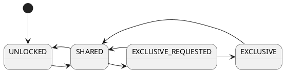

# Concurrency handling
Concurrent database writes can lead to database corruption if not coordinated correctly. This is why 
file- and memory locking strategies exist in `noid`. This also means that file locking always happens in concert 
with in-memory concurrency handling, never on its own. Different VFS implementations have different file locking 
features and as such `noid` must work with those to provide users with consistent behaviour. 
This can sometimes lead to slightly different locking strategies when comparing these VFS implementations.

## General Locking Algorithm
Readers are allowed to read concurrently from a database file or WAL-log, while writers must have exclusive access
before they are allowed to start writing. Both readers and writers must request their respective access types since
doing so has consequences for other concurrent readers and writers. This process is described in the state transitions
mentioned below. Note that `noid` currently only offers file-level locking, while more fine-grained locking may be
implemented some time in the future. Since a database is stored in a single file, this in turn means `noid` only 
supports database-scoped locking at this time.

### Concurrency States (lock levels)
* UNLOCKED - This is the initial locking state. There are no locks in effect.
* SHARED - Current and new concurrent reads are allowed, but no writes.
* EXCLUSIVE_REQUESTED - Current reads are allowed to finish, new readers are not accepted. Writers are not accepted.
* EXCLUSIVE - A writer is currently writing, no readers or writers accepted until exclusive lock is released or
downgraded. When shutting down, `noid` also requests an exclusive lock on the database and terminates connections
after acquiring it.

#### Concurrency State Transitions

## Unix VFS
On unix systems, POSIX file locks using `fcntl()` are _advisory_ locks, meaning that processes that don't use
`fcntl()` for locking can read and write to the file without problems due to locking. Additionally, these locks
are _process_-based so locks acquired by threads from the same process will not block locks acquired from different
threads of the same process. `Noid` works around this by combining `fcntl()` locks with `std::mutex`-es on the files'
inode, retrieved with `fstat()`. This enables running multiple `noid`-processes while still keeping the database files
consistent. There are other locking mechanisms like [dotfile locking](https://github.com/sqlite/sqlite/blob/master/src/os_unix.c#L2249)
which `noid` doesn't implement, but they are also not mandatory so not a real solution for this use case.
Still, this does not prevent rogue processes to alter the database files without `noid` noticing, and there is 
nothing `noid` can do about that.

### On using `close()`
A call to `close()` also closes any record locks held by the parent process so `noid` ensures `close()` is only
called after the last stream to a given file is closed. If a `noid::backend::vfs::UnixFile` is closed while
it is not the last stream to that file, the output buffers are flushed to disk and the corresponding `UnixFile` is 
marked as if it were closed.

## In-Memory VFS
Using `noid` as an in-memory database is possible, but only on a per-process basis. Since process memory must not be
accessible by other processes, it would be required to use memory-mapped files or some other form of inter-process 
communication which `noid` does not currently implement. Given these restrictions, the in-memory VFS only uses
mutexes for locking and the file-locking operations are no-ops if at all implemented.